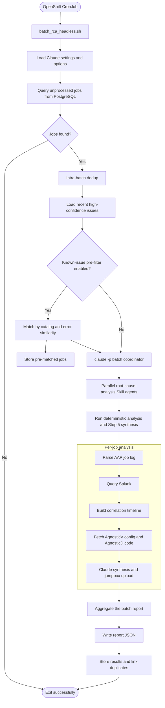

# aap2-rca-agent

Automated root-cause analysis for failed Ansible Automation Platform (AAP)
jobs on the Red Hat Demo Platform (RHDP). The installable Python package
contains the analysis and database helpers used by the current Claude Code
Skill and headless batch workflow.

## Architecture



## Installable Python package

The source tree uses the `src/rca` package layout. Runtime dependencies and
console entry points are declared in `pyproject.toml`; reusable modules are
installed once rather than copied into separate `common/` and batch-script
trees. The on-disk Skill and shell coordinator remain in place in this issue.

```bash
python3 -m venv .venv
.venv/bin/pip install -e '.[dev]'
.venv/bin/pytest
```

`rca-analyze` preserves the manual single-job and debugging commands:

```bash
rca-analyze analyze --job-id 1234567 --fetch
rca-analyze analyze --job-log /path/to/job.json.gz
rca-analyze parse --job-log /path/to/job.json.gz
rca-analyze query 'index=ocp_apps "x1234"' --earliest=-24h
rca-analyze status 1234567
rca-analyze upload --job-id 1234567
```

The CronJob continues to use `batch_rca_headless.sh`. Its Python helper steps
run as `python -m rca.batch.<module>` from the installed package. The
`rca-batch` console entry is a compatibility wrapper for that shell runner;
its Python replacement is a separate issue.

For a local batch run, point the wrapper at the legacy shell script:

```bash
RCA_LEGACY_BATCH_SCRIPT=deploy/batch-rca-automation/batch_rca_headless.sh \
  rca-batch --limit 15 --since '2026-09-30 12:00:00'
```

## Configuration and state

Configuration is read as data from `RCA_SETTINGS_FILE` (default discovery:
`./.claude/settings.json`, `./.claude/settings.local.json`, then
`~/.claude/settings.json`), `.env`, and the process environment. Precedence is
`.env` < `settings.json` < process environment. JSON values are parsed as
scalars and are not treated as shell code by Python.

Important settings include:

- `SOURCE_DB_*` for the AAP source and results tables.
- `JOB_LOGS_DIR`, `REMOTE_HOST`, and `REMOTE_DIR` for job-log retrieval.
- `SPLUNK_*` and `GITHUB_TOKEN` for deterministic enrichment.
- `JUMPBOX_URI` for uploading completed analysis.
- `RCA_STATE_DIR` (default `~/.rca`) for writable reports and analysis state.

Batch reports are written to `$RCA_STATE_DIR/reports/`. Per-job artifacts are
stored under `$RCA_STATE_DIR/.analysis/{job_id}/`. JSON schemas are included as
package resources and loaded with `importlib.resources`.

## Performance

| Metric | Value |
|---|---:|
| Jobs analyzed | 50+ jobs/day |
| Success rate | ~95% |
| Init time | ~14 seconds |
| Analysis time | 2–3 minutes for 5–7 jobs (parallel) |

These figures describe the existing production shell/Skill workflow; the
package-layout change is intended to preserve its behavior.

## Output

Batch reports are written to
`$RCA_STATE_DIR/reports/batch_YYYYMMDD_HHMMSS.json`:

```json
{
  "batch_id": "batch_YYYYMMDD_HHMMSS",
  "generated_at": "2026-09-30T12:00:00Z",
  "total_jobs_requested": 4,
  "total_jobs_analyzed": 3,
  "total_jobs_failed": 1,
  "timing": {
    "agent_spawn": "2026-09-30T12:00:00Z",
    "agent_completion": {},
    "wall_clock_total_ms": 150000,
    "aggregation_completed_at": "2026-09-30T12:02:30Z"
  },
  "root_cause_category_breakdown": {
    "infrastructure": {
      "count": 3,
      "job_ids": ["1234567", "1234568", "1234569"],
      "description": "Infrastructure"
    }
  },
  "confidence_breakdown": {"high": 2, "medium": 1, "low": 0},
  "high_priority_recommendations": [],
  "job_summaries": [],
  "failed_analyses": [],
  "cross_job_patterns": []
}
```

Per-job analysis files are saved under `$RCA_STATE_DIR/.analysis/{job_id}/`:
job context, Splunk logs, the correlation timeline, GitHub fetch history, and
the Step 5 analysis summary.

## Deployment and tests

The Docker image uses `python:3.12-slim` and installs the package. The bundled
Claude CLI binary is exposed for the existing shell runner without installing
Node. The CronJob still installs the on-disk Skill and prepares SSH/GCP
credentials in its init container.

```bash
.venv/bin/pytest
tests/run_integration_tests.sh
helm lint deploy/helm -f deploy/helm/values.example.yaml
```

PostgreSQL integration tests use a separate local test database and skip when
it is unavailable. Never point the test database settings at production.

## License

Apache License 2.0 — see [LICENSE](LICENSE).
